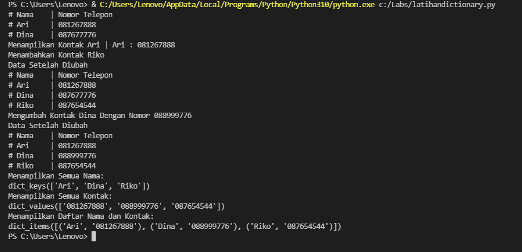

# pratikum5

## Latihan 1

### Membuat Daftar Kontak
#### Dibawah ini adalah source code dari progam membuat daftar kontak

1. print(nomor.keys())
Untuk perintah diatas berfungsi untuk mencetak semua nama
2. print(nomor.values())
Untuk perintah diatas adalah berfungsi untuk mencetak semua kontak yang sudah dibuat.
3. print(nomor.items())
Untuk perintah diatas adalah untuk mencetak semua daftar nama dan kotak yang sudah ada.
#### Berikut adalah hasil pemogramannya

## Pratikum 5

### Membuat Program Sederhana dengan Menampilkan Daftar Nilai Mahasiswa

#### Berikut adalah gambar flowchact dan code source program.
1. Dibawah adalah gambar flowchacrt program

2. Gambar Code Source Program

- print('='*60)
print('PROGRAM INPUT DATA')
print('='*60)                                           
Pada perintah diatas berfungsi untuk mencetak tabel progam input data.
- dict = {}                                         
Pada perintah diatas untuk membuat dictonary kosong dengan menggunakan tuple.
- while True:
    print('Pilih Menu Yang Tersedia')
    data = input('[L(ihat),T(ambah),U(bah),H(apus),C(ari),K(eluar) :')                                  
Pada perintah diatas adalah untuk mencetak menu atau penambahan menu dengan pilihan Lihat, Tambah, Ubah, Hapus, Cari, Keluar.
- if data in ('l', 'L'):
        if dict.items():
            print("-"*75)
            print("|Daftar Nilai                                                            |") 
            print("-"*75)
            print("|No. |    Nama    |     NIM     |  UTS  |  UAS  |  Tugas  |  Akhir       |")
            print("-"*75)
            i = 0 
            for y in dict.items():
                i += 1
                print("| {no:2} | {0:10} | {1:11} | {2:5} | {3:5} | {4:7} | {5:7}      |".format
                (y[0][:13], y[1][0], y[1][1], y[1][2], y[1][3], y[1][4], no=i))                                   
Untuk syntax lihat data dapat ditulis dengan 'l' atau 'L' yang akan menampilkan data  dari dictionary yang sudah dibuat, serta untuk menampilkan tabel data dengan ketentuan jarak yang telah dibuat.
- else:
           
            print("-"*75)
            print("|Daftar Nilai                              |") 
            print("-"*75)
            print("|No. |    Nama    |     NIM     |  UTS  |  UAS  |  Tugas  |  Akhir       |")
            print("-"*75)
            print("|                           TIDAK ADA DATA                               |") 
            print("-"*75)      
Untuk perintah diatas adalah jika kita mengetik 'l' maka akan menampilkan data jika belum memasukan data kedalam dictonary.
-  elif data in ('t','T'):
        print("Tambah Data")
        nama = input("Masukan Nama      : ")
        nim = int(input("Masukan NIM    : "))
        tugas = int(input("Nilai Tugas  : "))
        uts = int(input("Nilai UTS      : "))
        uas = int(input("Nilai UAS      : "))
        akhir = tugas * 0.30 + uts * 0.35 + uas * 0.35
        dict[nama] = nim, uts, uas, tugas, akhir                 
Untuk penambahan data dapat menuliskan 't' atau 'T', dengan nama sebagai keys dan angka sebagai values yang akan dimasukan pada dictionary yang telah dibuat.
- elif data in ('u','U'):
        print("Ubah Data")
        nama = input("Masukan Nama                  : ")
        if nama in dict.keys():
            nim = int(input("Masukan NIM    : "))
            tugas = int(input("Nilai Tugas  : "))
            uts = int(input("Nilai UTS      : "))
            uas = int(input("Nilai UAS      : "))
            akhir = tugas * 0.30 + uts * 0.35 + uas * 0.35                
            dict[nama] = nim, tugas, uts, uas, akhir        
Untuk mengubah data yang telah diinput dapat diketik dengan 'u' atau 'U' pada keyboard, maka akan menampilkan data yang telah diubah pada dictionary yang telah dibuat. 
- elif data in ('h','H'):
        print("Hapus Data")
        nama = input("Masukan Nama      : ")    
        if nama in dict.keys():
            del dict[nama]
        else:
            print("Nama {0} Tidak di Temukan".format(nama))     
Untuk menghapus data dapat kita ketik dengan huruf 'h' atau 'H' yang akan menghapus data pada dictonary yang telah dibuat dengan menggunakan perintah del dict [nama].
- elif data in ('c','C'):
        print("Cari Data")            
        nama = input("Masukan Nama      : ")
        if nama in dict.keys():
            print("-"*75)
            print("|Daftar Nilai                              |")  
            print("-"*75)
            print(nama, nim, uts, uas, tugas,akhir)
            print("-"*75)
        else:
            print("Nama {0} Tidak di Tentukan".format(nama))     
Untuk mencari data dapat kita ketik dengan huruf 'c' atau 'C' yang akan melakukan pencarian data dengan memasukan data yang ingin kita cari pada dictionary yang sudah kita buat sebelumnya.
- elif data in ('k','K'):
        print("Terima Kasih")
        break                                       
Code diatas adalah keluar dari program untuk menghentikan program jika kita mengetik 'k' atau 'K' maka otomatis progam akan keluar.
- else:
        print("Pilih Menu Yang Tersedia")                   
Code diatas adalah menampilkan pilihan menu yang tersedia yaitu L,T,U,C,H,K jika kita memilih salah satu dari pilhan menu yang sudah ada maka akan menampilkan perintah sesuai dengan yang kita ketik.

#### Berikut adalah gambar hasil pemograman
